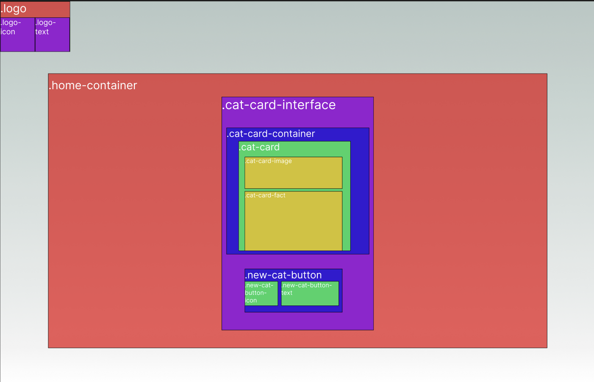

# Next.js project with Sass and CI

[How I built this environment](#how-i-built-this-environment) |

## Schedule

Started 13.50
_All times include regular Pomodoro breaks_

Planning phase and setting up environment (1.5 hours)
lunch ends 15.50
Building and testing

## Planning Tests

#### Check for elements

1. Create exist tests for all this planned HTML (not cat-card-container and children).
   

#### Test functionality

1. Press button and cat-card-container and children should exist

(STRETCH) show multiple cat cards on multiple button presses

2. Cat button should be disabled for 2 seconds after click

```Cypress
// Rough plan
  cy.get('button').click();
  cy.get('button').should('be.disabled');
  cy.wait(2000);
  cy.get('button').should('not.be.disabled');
```

### API

#### Unit

1. It should return a cat fact from the API

#### Integration

1. It should display the cat fact in HTML

#### E2E

1. it displays the cat fact and image'

```Cypress
// Rough plan
    cy.visit('/');

    cy.get('#cat-fact').should('contain', 'Did you know?');
    cy.get('#cat-image').should('exist');
```

## How I built this environment

### Next.js

`npx create-next-app .`

### install dependencies

`npm i sass jest cypress`

### Styling (Sass)

Add sass options to next.config.js

```javascript
/** @type {import('next').NextConfig} */
const path = require("path");

const nextConfig = {
  reactStrictMode: true,
  sassOptions: {
    includePaths: [path.join(__dirname, "styles")],
  },
};

module.exports = nextConfig;
```

[Setup sass directories based on 7-1 pattern](https://sass-guidelin.es/#the-7-1-pattern)

[Download from here for easy setup](https://github.com/PatrickReynoldsCoding/sass-boilerplate-with-emotion-version)

Compile sass using:

`sass --watch sass/main.scss:styles/Home.module.css`

#### Preserve CSS hyphenated class names

Next.js uses Emotion-Library and imports styles as a JS object. This will throw an error with any css classnames that are hyphanated.

E.g:

```javascript

  <div className={styles.class-name} >

```

To prevent editing all your hyphenated class names, you can call them as an array element.

```javascript

  <div className={styles['cat-button']} >

```

### Testing (Jest & Cypress)

#### Jest

Add `"test": "jest"` to scripts in package.json

Create spec folder in root for any unit and integration tests

#### Cypress

Run to open wizard and setup scaffolding `npx cypress open`

#### CI

Create .github/workflow/ci.yml

This boilerplate code I've written will enable run Jest and Cypress tests upon each merge:

````Github Actions
name: CI

on:
  push:
    branches:
      - main
  pull_request:
    branches:
      - main

env:
  NODE_VERSION: 14

jobs:
  build:
    runs-on: ubuntu-latest

    strategy:
      matrix:
        node-version: [18]

    name: Node.js ${{ matrix.node-version }}
    steps:
    - name: Checkout code
      uses: actions/checkout@v2

    - name: Setup Node.js
      uses: actions/setup-node@v2
      with:
        node-version: ${{ env.NODE_VERSION }}

    - name: Install dependencies
      run: |
        npm ci

    - name: Test with Jest
      run: |
        npm test

    - name: Checkout
      uses: actions/checkout@v3

    - name: Cypress run
      uses: cypress-io/github-action@v5
      with:
        start: npm run dev
        wait-on: 'http://localhost:3000'
        ```
````
