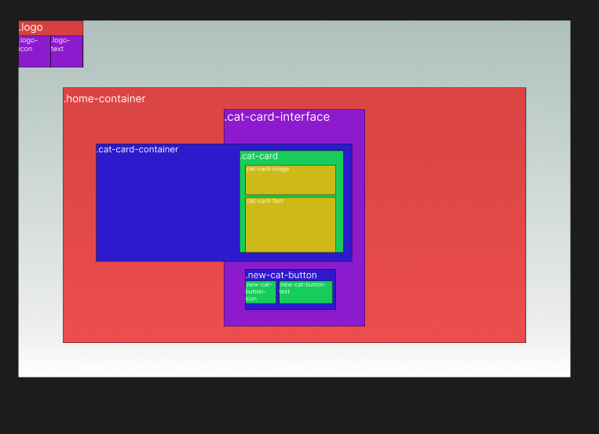

# SnapCat a site to learn more about cats

[Click here to visit the site!](https://snap-cat.vercel.app/)

[About](#about) | [Technologies used](#technologies-used) | [Usage](#usage) |  [Development](#development) |  [How to built this environment](#how-to-built-this-environment) | [Contact](#contact)

## About

This is a simple one page website built with Next.js.
It's aim is to use a button to pull a cat fact from [https://catfact.ninja/#/Facts/](https://catfact.ninja/#/Facts/) and a cat image from [https://api.thecatapi.com/v1/images/search](https://api.thecatapi.com/v1/images/search) and present in a card.

## Technologies used

### Testing

- Cypress
- Jest
- Github Actions for CI

### Styling

- Sass
- Figma [Click here to see Figma Design file](https://www.figma.com/file/2Avg8gYm4astD7qN4cxads/Kittypedia?node-id=0%3A1&t=6G29p3HFnX7Ndu6v-0)

### Linting

- Prettier (VSCode Extension)
- Eslint
- Error Lens (VSCode Extension)

### Planning

- Figma Jam [Click here to see Figma Jam file](https://www.figma.com/file/KFcO9Q84bRAG9h9ribW9XC/Kittypedia?node-id=14%3A48&t=7Pc0lplwbEWBF5Bd-0)
- Github Projects [Click here to see Github Projects kanban board](https://github.com/users/PatrickReynoldsCoding/projects/8/views/1)

### Deployment

- Vercel

## Usage

Upon visiting the site, click the "New cat" button. this will generate a cat card. Keep clicking for more cards to appear.

## Development

### Planning style

Initial Planning:

<kbd></kbd>

Styling moodboard:

<kbd></kbd>

Figma catCard concepts:

<kbd></kbd>

Figma MVP mockup:

<kbd></kbd>

Figma planning needed html:

<kbd></kbd>


### Planning Tests


#### Unit testing with Cypress

- Test the rendering of the logo and the button to make sure they are present and functioning correctly.

#### Integration testing with Cypress

- Test the complete flow of the website starting from loading the page, clicking the button and checking if the cards are rendered correctly.

- Test the functionality of the button to make sure it's adding the cards correctly when pressed.

- Test the functionality of the button to make sure its disabled for 1 second after first click.

- Test the functionality of the APIs to make sure they are returning data and the data is being displayed correctly on the cards.

- Test the responsiveness of the website to make sure it's working correctly on different screen sizes.

## How to built this environment

### Next.js

`npx create-next-app .`

### install dependencies

`npm i sass jest cypress`

### Styling (Sass)

Add sass options to next.config.js

```javascript
/** @type {import('next').NextConfig} */
const path = require("path");

const nextConfig = {
  reactStrictMode: true,
  sassOptions: {
    includePaths: [path.join(__dirname, "styles")],
  },
};

module.exports = nextConfig;
```

[Setup sass directories based on 7-1 pattern](https://sass-guidelin.es/#the-7-1-pattern)

[Download from here for easy setup](https://github.com/PatrickReynoldsCoding/sass-boilerplate-with-emotion-version)

Compile sass using:

`sass --watch sass/main.scss:styles/Home.module.css`

#### Preserve CSS hyphenated class names

Next.js uses Emotion-Library and imports styles as a JS object. This will throw an error with any css classnames that are hyphanated.

E.g:

```javascript

  <div className={styles.class-name} >

```

To prevent editing all your hyphenated class names, you can call them as an array element.

```javascript

  <div className={styles['cat-button']} >

```

### Linting 

#### Install

`eslint --init`

#### Config

``` Javascript
// .eslintrc.js
// Add these properties to config

    "extends": [
        "next"
    ],
    "rules": {
      "react/prop-types": "off",
      "indent": ["error", 2]
    }
```

#### Run

`npm run lint`

### Testing (Jest & Cypress)

#### Jest

Add `"test": "jest"` to scripts in package.json

Create spec folder in root for any unit and integration tests

#### Cypress

Run to open wizard and setup scaffolding `npx cypress open`

Add baseUrl to cypress.config.js

```Javascript
  e2e: {
    baseUrl: "http://localhost:3000",
    setupNodeEvents(on, config) {
      // implement node event listeners here
    },
  },
});
```

#### CI

Create .github/workflow/ci.yml

This boilerplate code I've written will enable run ESlint, Jest and Cypress tests upon each merge:

````Github Actions
name: CI

on:
  push:
    branches:
      - main
  pull_request:
    branches:
      - main

env:
  NODE_VERSION: 14

jobs:
  build:
    runs-on: ubuntu-latest

    strategy:
      matrix:
        node-version: [18]

    name: Node.js ${{ matrix.node-version }}
    steps:
    - name: Checkout
      uses: actions/checkout@v3

    - name: Setup Node.js
      uses: actions/setup-node@v2
      with:
        node-version: ${{ env.NODE_VERSION }}

    - name: Install dependencies
      run: |
        npm install

    - name: Run ESLint
      run: npm run lint

    - name: Test with Jest
      run: |
        npm test

    - name: Cypress run
      uses: cypress-io/github-action@v5
      with:
        start: npm run dev
        wait-on: 'http://localhost:3000'

````

## Helpful resourses

### Getting cypress testing to work with emotion libraries unique classNames

- [https://github.com/cypress-io/cypress/issues/1212](https://github.com/cypress-io/cypress/issues/1212)
- [CSS attribute selector](https://www.w3schools.com/css/css_attribute_selectors.asp#:~:text=The%20%5Battribute*%3D%22value%22,to%20be%20a%20whole%20word!)

## Contact

Email: [PatrickReynoldsCoding@gmail.com](https://mail.google.com/mail/u/0/?fs=1&to=patrickreynoldscoding@gmail.com&su=Hi%20Paddy&body=&tf=cm)

Linkedin: [Linkedin](https://www.linkedin.com/in/reynolds-patrick/)

Website: [PatrickReynolds.dev](https://www.patrickreynolds.dev/)
